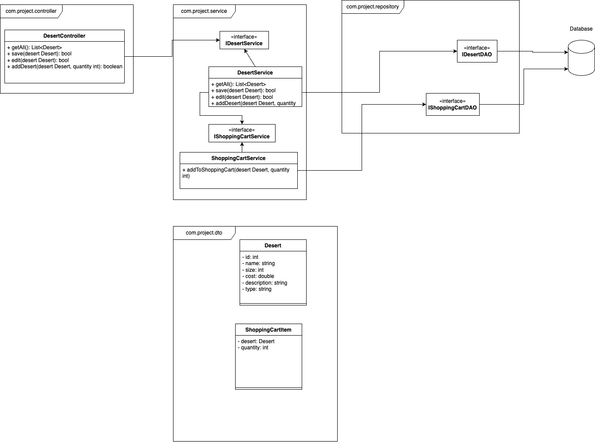

# BlissBites

## Introduction
BlissBites is an online dessert ordering service for a wide variety of desserts including cakes, cupcakes, brownies, muffins, cookies, and candies.

Users are able to select dessert items to cart and place their orders.

Admins are able to add/update the dessert products users select.

## Storyboard

## Class Diagram

## JSON Schema

## Team Memebers and Roles
Github Admin/Developer - Vishvak Chintalapalli\
Product Owner/Developer - Dakota Smith\
Developer - Elliot Phillips\
Developer - Ravi Patel\
Developer - Aj White

## Standup
Team meets every Thursday at 4:00pm in CECH Library
